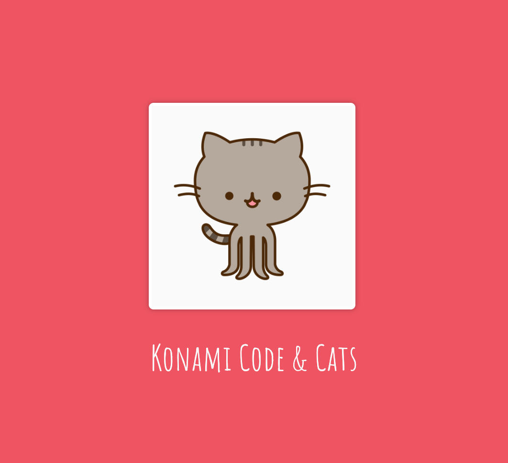
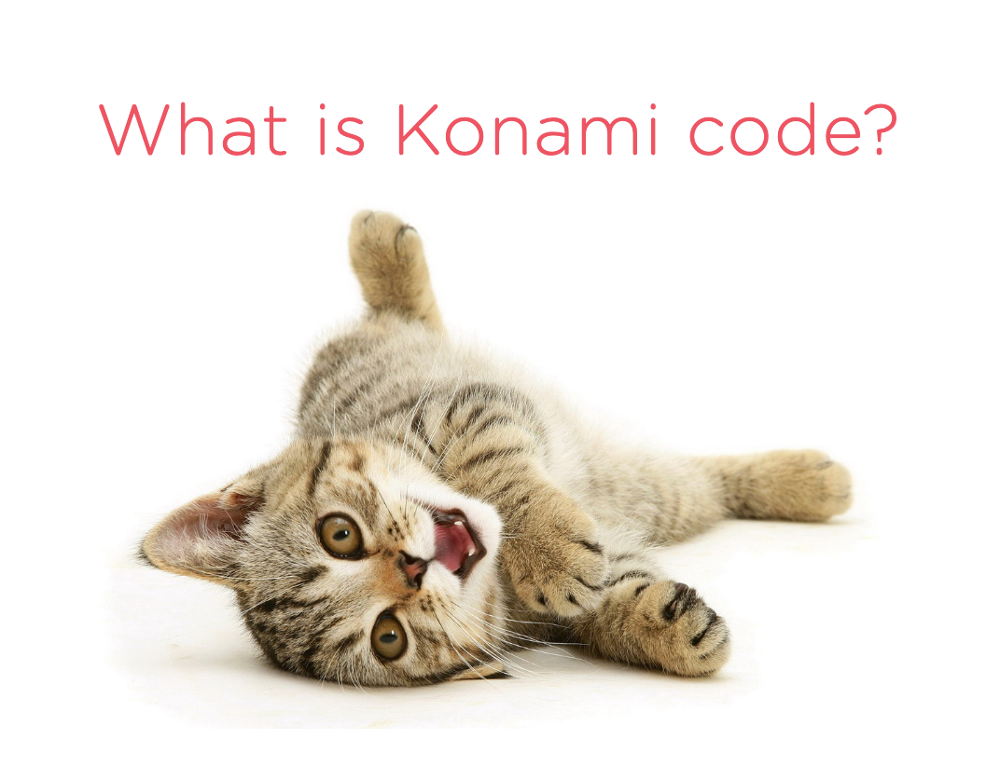
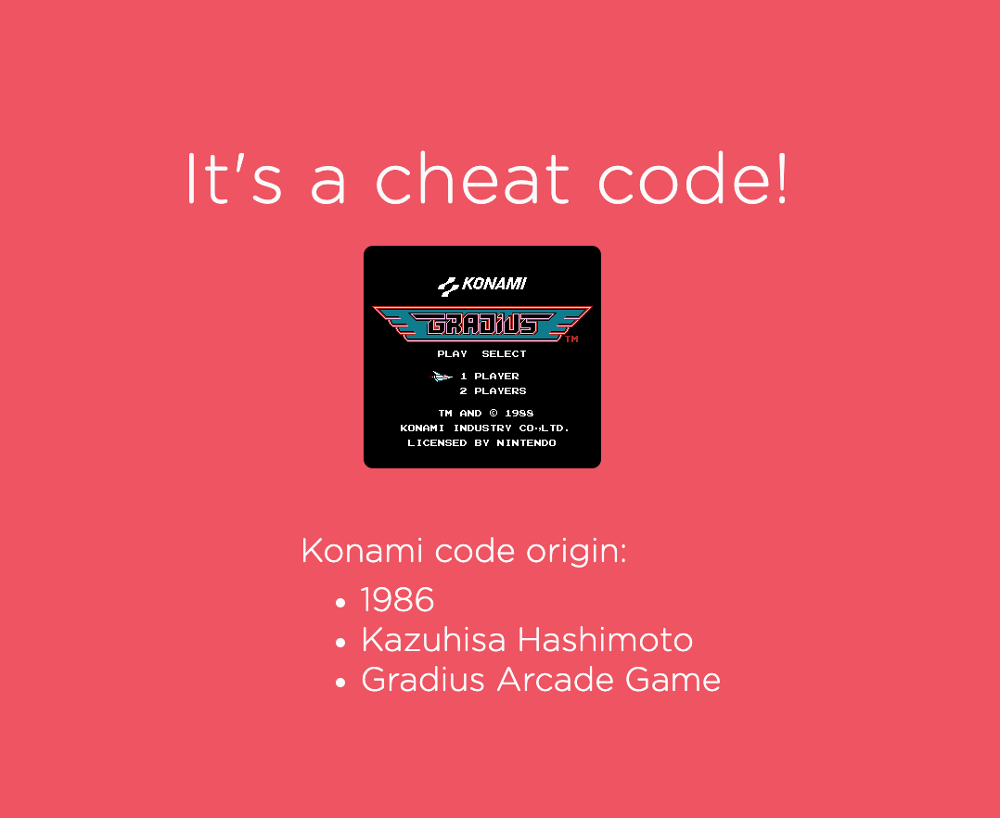

I've given a few lightning talks on this subject and figured I'd share it here.

---

\

You may be asking yourself, "What do cats have to do with Konami code?" The answer is: absolutely nothing. Enjoy!

\

Game developer Kazuhisa Hasimoto was a Konami employee working on the development of the Gradius arcade game in 1986. He didn't want to test every level every time something changed in a higher level, so he created a cheat code for himself for testing purposes only. But he forgot to remove the code before the game went to production. 

<small><i>Almost like this cat, Konami code hides in the background.</i></small>

---

You can find an example of konami code in [this repo](https://github.com/parkerdyer/konamicat). 
